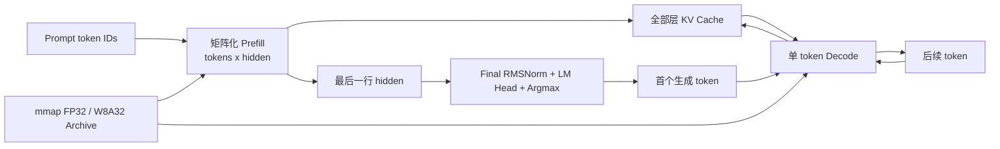

# Qwen2.5 C++/CUDA 推理框架

这是一个面向性能分析的 batch=1 Qwen2.5 推理框架。运行时只依赖 C++17、
CUDA/cuBLAS 和 OpenBLAS，不依赖 PyTorch/Transformers。当前模型固定为
`Qwen/Qwen2.5-0.5B-Instruct`，支持完整矩阵化 Prefill、KV Cache、单 token
Decode、CPU/CUDA FP32、group-size=64 的 W8A32、greedy decoding、统一 benchmark
与 Nsight Systems 标注。

当前运行时不保留“逐 token 调用 Decode 来模拟 Prefill”的模式。Prompt 阶段的唯一
正式实现就是矩阵化 Prefill；单 token 前向仅作为模型内部的 Decode 实现存在。

## 当前设备

- NVIDIA Jetson Orin Nano Super 8GB，SM 8.7
- Ubuntu 22.04 / JetPack 6.2.1 / CUDA 12.6
- 项目目录：`/path/to/qwen2.5-jetson-inference`

## 快速开始

```bash
cd /path/to/qwen2.5-jetson-inference
bash scripts/bootstrap.sh

.venv/bin/python tools/download_model.py \
  --output models/source/Qwen2.5-0.5B-Instruct

.venv/bin/python tools/export_model.py \
  --source models/source/Qwen2.5-0.5B-Instruct \
  --output models/qwen2.5-0.5b-instruct \
  --precision all --group-size 64

export PATH=/usr/local/cuda/bin:$PATH
cmake -S . -B build -DCMAKE_BUILD_TYPE=Release -DCMAKE_CUDA_ARCHITECTURES=87
cmake --build build --parallel "$(nproc)"
ctest --test-dir build --output-on-failure
```

生成文本：

```bash
./build/llm_infer generate \
  --model models/qwen2.5-0.5b-instruct \
  --backend cuda --precision fp32 --cublas \
  --prompt "用一句话解释什么是大语言模型。" \
  --max-new-tokens 32
```

查看模型和内存规划：

```bash
./build/llm_infer inspect \
  --model models/qwen2.5-0.5b-instruct \
  --precision w8a32 --max-seq-len 2048
```

运行 canonical benchmark。runner 默认使用固定的 32-token IDs、128-token 输出、
5 次 warmup 和 20 次测量，并记录代码、模型、设备、温度、功耗与统计分布：

```bash
mkdir -p results
python3 tools/run_benchmark.py \
  --binary build/llm_infer \
  --model models/qwen2.5-0.5b-instruct \
  --backend cuda --precision fp32 --cublas --lock-clocks \
  --output results/cuda-fp32-matrixized.json
```

密码不会写入脚本或结果。锁频权限需要在运行前由用户配置，runner 会在退出路径恢复
原状态。

Nsight Systems：

```bash
MODEL_DIR="$PWD/models/qwen2.5-0.5b-instruct" bash scripts/profile.sh
```

## Prefill 与 Decode 数据流



每个 decoder layer 执行 `RMSNorm → Q/K/V → RoPE → GQA → O projection → residual
→ RMSNorm → SwiGLU MLP → residual`。

- `prefill(prompt_tokens)` 一次处理完整 Prompt，采用 `[tokens, hidden]` 布局，
  写入全部层的 KV Cache，只对最后一个 Prompt token 执行最终 RMSNorm、LM Head
  和 argmax。
- CPU FP32 Linear 使用 OpenBLAS SGEMM。
- CUDA FP32 可使用自研 tiled GEMM 或 cuBLAS SGEMM；CUDA W8A32 使用 INT8 weight
  + FP32 activation GEMM。
- causal attention 按 query 在线计算 softmax，不分配完整
  `[tokens, tokens]` attention matrix。
- `decode_next(token)` 只处理一个新 token 并复用 Prefill 生成的 KV Cache。
- Prefill workspace 按 `max-seq-len` 预分配；超出容量会显式报错。

状态机拆分见 [CODEX-CP05](docs/codex-cp05-prefill-decode-state-machine.md)，CPU 和
CUDA 矩阵化实现分别见 [CODEX-CP06](docs/codex-cp06-cpu-fp32-batched-prefill.md)
与 [CODEX-CP07](docs/codex-cp07-cuda-batched-prefill.md)。

## 模型文件

`QWENBIN1` 文件前 1 MiB 为固定头和 JSON tensor index，数据区按 256 字节对齐。
每个记录包含名称、shape、dtype、offset、字节数和 SHA-256。INT8 Linear 额外记录
scale tensor、量化轴和 group size。C++ 使用只读 `mmap`，CUDA 初始化时将权重一次性
上传到单个连续 device buffer。

当前归档：

- `model.fp32.qbin`
- `model.int8.qbin`，即 W8A32

后续名为 W16A16/W8A16 的 A16 路径使用 BF16，不使用 FP16。

## 目录与文档命名

- `include/infer`、`src`：运行时、模型和 CPU/CUDA 算子。
- `tools`：模型下载、无 PyTorch 导出、golden 生成和 benchmark runner。
- `tests`：CPU/CUDA 算子、Prefill/Decode 状态与数值回归。
- `scripts`：环境、构建和 profiling 入口。
- `results/`、`profiles/`：忽略的原始测量与 trace。
- `benchmarks/results/`：经过审核、纳入版本控制的轻量结果。
- `docs/codex-cpXX-*.md`：各 checkpoint 的历史测试报告。
- `docs/codex-cleanup-*.md`：不属于编号 checkpoint 的工程整理报告。

历史 CP03–CP08 报告保留 serial 数据，是矩阵化优化前后的可审计证据。报告里的
`--prefill-mode` 命令属于对应历史 commit；当前运行时已删除该选项。

## 已知边界

- 只支持 Qwen2 架构、batch=1 和 greedy decoding。
- Prefill causal attention 不是 FlashAttention，也不支持 chunked Prefill。
- 当前 W8A32 Prefill GEMM 以正确性和可读性为主，尚未达到成熟 GEMM 的数据复用效率。
- Jetson 为统一内存设备，峰值内存需结合 RSS 与 `tegrastats`，不能套用桌面卡的
  `nvidia-smi --query-compute-apps` 口径。
- 绝对性能数字必须附带 commit、模型 SHA、功耗模式、CUDA 版本和 benchmark JSON。

## 当前实测摘要

在 32-token Prompt + 128-token Output、5 warmup + 20 repeats 下，单 token Decode
吞吐为 CUDA FP32 22.82 tok/s、W8A32 32.97 tok/s（+44.44%）；W8A32 模型文件缩小
53.16%。完整口径见 [Jetson 结果](docs/07-jetson-results.md)。

在 commit `d667fb113619ef133dea7f54085216799cf1ae72` 的 Prefill sweep 中：

- CPU FP32 的 32/128/512-token TTFT 加速为 `6.50x/8.29x/6.07x`。
- CUDA FP32 cuBLAS 的 32/128/512-token TTFT 加速为
  `34.42x/47.80x/30.83x`。
- CUDA W8A32 的 32/128/512-token TTFT 加速为 `1.37x/1.38x/1.39x`。
- 28 组正式结果的 TTFT CV 均不超过 3%，Prefill 内无逐 token CUDA 内存分配。

完整协议、能耗、workspace 和 Nsight 证据见
[CODEX-CP08](docs/codex-cp08-prefill-benefit-validation.md)，审核摘要见
[benchmarks/results/codex-cp08-prefill-sweep-summary.json](benchmarks/results/codex-cp08-prefill-sweep-summary.json)。

可重复执行完整数值对照：

```bash
.venv/bin/python tools/validate_parity.py \
  --source models/source/Qwen2.5-0.5B-Instruct \
  --runtime models/qwen2.5-0.5b-instruct \
  --output results/golden/parity.json
```
