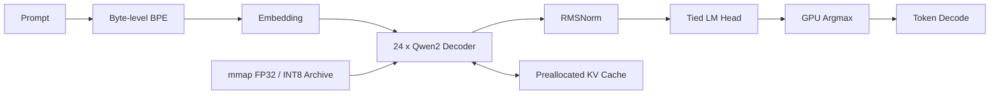

# Qwen2.5 C++/CUDA 推理框架

这是一个面向学习和性能分析的 batch=1 推理框架。运行时只依赖 C++17、CUDA/cuBLAS
和 OpenBLAS，不依赖 PyTorch/Transformers。当前模型固定为
`Qwen/Qwen2.5-0.5B-Instruct`，支持 CPU/CUDA、FP32、group-size=64 的 INT8
Weight-only（W8A32）、KV Cache、greedy decoding、benchmark 与 Nsight Systems 标注。

## 当前设备

- NVIDIA Jetson Orin Nano Super 8GB，SM 8.7
- Ubuntu 22.04 / JetPack 6.2.1 / CUDA 12.6
- 项目目录：`/path/to/qwen2.5-jetson-inference`

## 快速开始

```bash
cd /path/to/qwen2.5-jetson-inference
bash scripts/bootstrap.sh

.venv/bin/python tools/download_model.py \
  --output models/source/Qwen2.5-0.5B-Instruct

.venv/bin/python tools/export_model.py \
  --source models/source/Qwen2.5-0.5B-Instruct \
  --output models/qwen2.5-0.5b-instruct \
  --precision all --group-size 64

export PATH=/usr/local/cuda/bin:$PATH
cmake -S . -B build -DCMAKE_BUILD_TYPE=Release -DCMAKE_CUDA_ARCHITECTURES=87
cmake --build build --parallel "$(nproc)"
ctest --test-dir build --output-on-failure
```

生成文本：

```bash
./build/llm_infer generate \
  --model models/qwen2.5-0.5b-instruct \
  --backend cuda --precision fp32 \
  --prompt "用一句话解释什么是大语言模型。" \
  --max-new-tokens 32
```

查看模型和内存规划：

```bash
./build/llm_infer inspect \
  --model models/qwen2.5-0.5b-instruct \
  --precision int8 --max-seq-len 2048
```

固定协议 benchmark：

```bash
mkdir -p results
./build/llm_infer benchmark \
  --model models/qwen2.5-0.5b-instruct \
  --backend cuda --precision fp32 \
  --prompt "请简要介绍 CUDA。" --max-new-tokens 128 \
  --warmup 5 --repeat 20 --json results/jetson-fp32.json
```

Nsight Systems：

```bash
MODEL_DIR="$PWD/models/qwen2.5-0.5b-instruct" bash scripts/profile.sh
```

## 数据流



每个 decoder layer 执行 `RMSNorm → Q/K/V → RoPE → GQA → O projection → residual
→ RMSNorm → SwiGLU MLP → residual`。CPU FP32 Prefill 使用 `[tokens, hidden]`
布局，Linear 由 OpenBLAS GEMM 批量计算，causal attention 不保存完整 attention matrix。
`auto` 在 CPU FP32 且 prompt 长度不少于 2 时选择 batched，其余现有路径仍选择 serial。
状态机拆分见 [`CODEX-CP05`](docs/codex-cp05-prefill-decode-state-machine.md)，CPU
矩阵化实现见 [`CODEX-CP06`](docs/codex-cp06-cpu-fp32-batched-prefill.md)。

## 模型文件

`QWENBIN1` 文件前 1MiB 为固定头和 JSON tensor index，数据区按 256 字节对齐。
每个记录包含名称、shape、dtype、offset、字节数和 SHA-256。INT8 Linear 额外记录
scale tensor、量化轴和 group size。C++ 使用只读 `mmap`，CUDA 初始化时将权重一次性
上传到单个连续 device buffer。

## 目录

- `include/infer`、`src`：运行时、模型和 CPU/CUDA 算子。
- `tools`：模型下载、无 PyTorch 导出、Transformers golden 生成。
- `tests`：CPU/CUDA 数值单测。
- `docs`：原理、实现和性能分析笔记。
- `scripts`：环境、构建、profiling 的可复现入口。

## 已知边界

- 只支持 Qwen2 架构、batch=1 和 greedy decoding。
- 当前 CUDA attention 是易读的 decode kernel，不是 FlashAttention。
- CUDA FP32/W8A32 Prefill 仍为 serial；CPU FP32 已支持 serial/batched。
- Jetson 为统一内存设备，峰值内存需结合 RSS 与 `tegrastats`，不能使用桌面卡的
  `nvidia-smi --query-compute-apps` 口径。
- 绝对性能数字必须附带 commit、模型、功耗模式、CUDA 版本和完整 benchmark JSON。

## 当前实测摘要

在本机固定 32-token prompt + 128-token output、5 warmup + 20 repeats 下，FP32 为
22.82 tok/s，INT8 为 32.97 tok/s（+44.44%）；模型文件缩小 53.16%。完整口径、
正确性误差和内存数据见 [`docs/07-jetson-results.md`](docs/07-jetson-results.md)。

可重复执行完整数值对照：

```bash
.venv/bin/python tools/validate_parity.py \
  --source models/source/Qwen2.5-0.5B-Instruct \
  --runtime models/qwen2.5-0.5b-instruct \
  --output results/golden/parity.json
```
